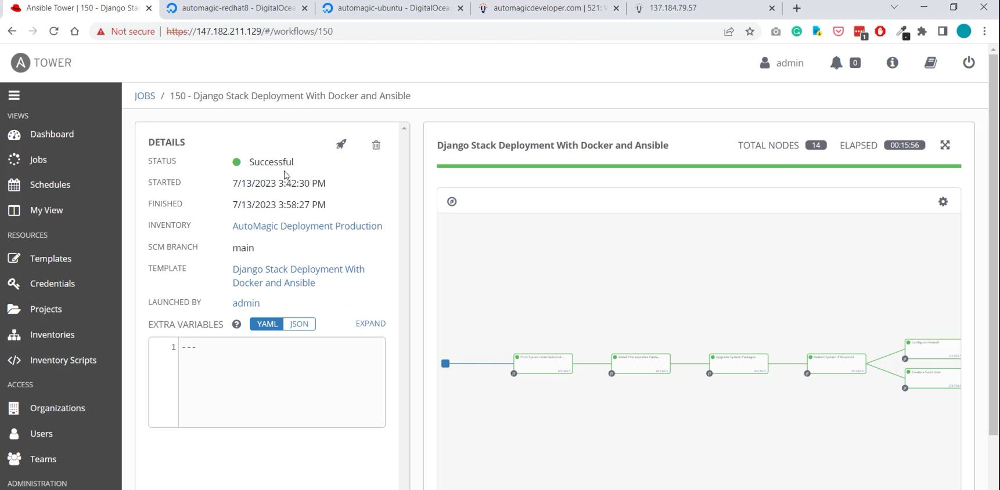
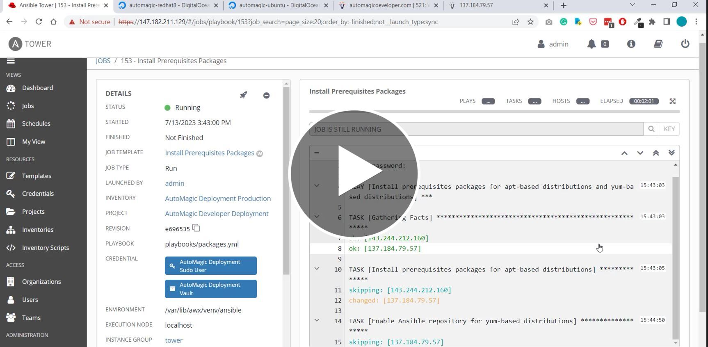

<!-- PROJECT SHIELDS -->
<!--
*** I'm using markdown "reference style" links for readability.
*** Reference links are enclosed in brackets [ ] instead of parentheses ( ).
*** See the bottom of this document for the declaration of the reference variables
*** for contributors-url, forks-url, etc. This is an optional, concise syntax you may use.
*** https://www.markdownguide.org/basic-syntax/#reference-style-links
-->

[![LinkedIn][linkedin-shield]][linkedin-url]

<!-- PROJECT LOGO -->
 

    

  <h3 align="center">Django Stack Deployment With Docker And Ansible</h3>

<!-- TABLE OF CONTENTS -->

  
Table of Contents

  <ol>
    <li>
      <a href="#about-the-project">About The Project</a>
      <ul>
        <li><a href="#built-with">Built With</a></li>
      </ul>
    </li>
    <li><a href="#preview-video">Preview Video</a></li>
    <li><a href="#roadmap">Roadmap</a></li>
    <li><a href="#contact">Contact</a></li>
  </ol>

<!-- ABOUT THE PROJECT -->
## About The Project

* Project Name: Django Stack Deployment With Docker And Ansible
* Version: v1.0.0
* Organization Department: Technology

### Description

I have developed an Ansible project that automates the deployment of a 
Django web application across multiple hosts simultaneously, 
leveraging the power of Docker and Ansible.

Using Docker Compose, I have containerized the Django web application, 
creating a scalable and portable environment. The application is divided into 
four containers, each serving a specific purpose. The first container 
hosts the Django app, while the second container houses the Postgres database, 
ensuring reliable data storage. Nginx, in the third container, 
along with Let's Encrypt, generates an SSL certificate to 
enhance the security of user interactions. 
The fourth container runs a crontab Python project, 
continuously monitoring system resources and ingesting 
the data into the database. This real-time data is then 
utilized within a dashboard app integrated into the Django website.

To streamline the deployment process, I have developed a comprehensive 
Ansible project. This project automates various tasks required to 
set up and configure the entire application stack on new servers 
running Ubuntu or RedHat OS:
- Installs necessary system packages, updates existing packages, and 
manages system restarts when necessary.
- Creates a new Sudo user, securely protecting the password within an Ansible vault.
- Configures UFW firewall on Ubuntu servers and Firewalld on RedHat servers, 
allowing access to specific ports while denying others by default.
- Handles generation and configuration of SSH key pairs for secure communication 
with private Git repositories.
- Integrates seamlessly with the project's Git repository, pulling the 
Django-Docker stack from a private GitHub repository.
- Dynamically configures the Nginx server based on the defined HQ host or other 
hosts.
- Uses a Jinja2 template to generate specific Nginx configurations for non-HQ 
hosts, allowing the server to listen exclusively on port 80.
- Automates extraction of database files into a bind-mounted directory for 
seamless access by the Postgres database container.
- Starts all four containers to bring the entire application stack to life, 
resulting in a fully functional and high-performance web application.

(<a href="#readme-top">back to top</a>)

### Built With

This project was developed using the following tech stacks:
* Ansible
* Docker
* Django
* HTML, CSS, Bootstrap, and JavaScript
* Nginx
* Let's Encrypt
* Postgres

(<a href="#readme-top">back to top</a>)

## Preview Video

(<a href="#readme-top">back to top</a>)

<!-- ROADMAP -->
## Roadmap

- [x] Develop an Ansible project to automate the deployment of a Django web application using Docker and Ansible.
- [x] Containerize the Django web application using Docker Compose with four distinct containers.
- [x] Implement system resource monitoring and real-time data ingestion into a Django dashboard app.
- [x] Create Ansible playbooks to install required system packages and update existing packages.
- [x] Configure system restarts, create a new Sudo user, and secure the password within an Ansible vault.
- [x] Set up UFW firewall on Ubuntu servers and Firewalld on RedHat servers, allowing access to specific ports and disabling others by default.
- [x] Generate SSH key pairs for secure communication with private Git repositories and configure Git settings.
- [x] Integrate the Django-Docker stack from a private GitHub repository and fetch the latest project version.
- [x] Customize Nginx configurations based on the HQ host or non-HQ hosts using Jinja2 templates.
- [x] Automate the extraction of database backups into a bind-mounted directory for seamless utilization by the Postgres container.
- [x] Ensure the successful deployment of the entire application stack across multiple hosts using Ansible.

(<a href="#readme-top">back to top</a>)

<!-- CONTACT -->
## Contact

Mohamed AbdelGawad Ibrahim - [@m-abdelgawad](https://www.linkedin.com/in/m-abdelgawad/) - <a href="tel:+201069052620">+201069052620</a> - muhammadabdelgawwad@gmail.com

GitHub Profile Link: [https://github.com/m-abdelgawad](https://github.com/m-abdelgawad)

(<a href="#readme-top">back to top</a>)

<!-- MARKDOWN LINKS & IMAGES -->
 [linkedin-shield]: https://img.shields.io/badge/-LinkedIn-black.svg?style=for-the-badge&logo=linkedin&colorB=555
[linkedin-url]: https://www.linkedin.com/in/m-abdelgawad/
