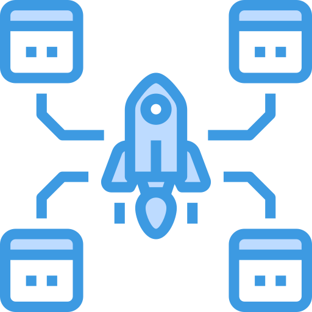

[![LinkedIn][linkedin-shield]][linkedin-url]

<!-- PROJECT LOGO -->
 

    

  <h3 align="center">Django Deployment Automation with Docker & Ansible</h3>

<!-- TABLE OF CONTENTS -->

  
Table of Contents

  <ol>
    <li>
      <a href="#about-the-project">About The Project</a>
      <ul>
        <li><a href="#built-with">Built With</a></li>
      </ul>
    </li>
    <li><a href="#preview-video">Preview Video</a></li>
    <li><a href="#roadmap">Roadmap</a></li>
    <li><a href="#contact">Contact</a></li>
  </ol>

<!-- ABOUT THE PROJECT -->
## About The Project

* **Project Name:** Django Deployment Automation with Docker & Ansible  
* **Version:** v1.0.0  
* **Department:** Technology

---

### Description

This project automates the deployment of a Django web application across multiple hosts using Docker and Ansible. The setup is fully containerized with Docker Compose, allowing for scalable and portable application environments. The application stack consists of four containers, each serving a critical function:

* **Django Application Container:** Hosts the web application, developed with Python (Django), HTML, CSS, Bootstrap, and JavaScript.
* **Postgres Database Container:** Ensures reliable data storage.
* **Nginx Container:** Serves the web application and generates SSL certificates with Let's Encrypt to secure communications.
* **Crontab Container:** Runs a Python project that monitors system resources and ingests data into the database for real-time visualization on a dashboard.

The Ansible project automates the setup of this stack on servers running Ubuntu or RedHat, including:

- Installation and update of required system packages.
- Creation of a secure sudo user, with credentials stored in an Ansible vault.
- Firewall configuration using UFW for Ubuntu and Firewalld for RedHat.
- SSH key pair generation and Git configuration for secure project pulls.
- Dynamic Nginx configuration using Jinja2 templates.
- Database management and backup handling via bind-mounted directories.
- Full container orchestration with Docker Compose to deploy the stack.

(<a href="#readme-top">back to top</a>)

---

### Built With

This project was developed using the following tech stacks:

* **Ansible**
* **Docker**
* **Django**
* **HTML, CSS, Bootstrap, JavaScript**
* **Nginx**
* **Let's Encrypt**
* **Postgres**

(<a href="#readme-top">back to top</a>)

---

## Preview Video

(<a href="#readme-top">back to top</a>)

---

## Roadmap

- [x] Develop Ansible playbooks for Django-Docker deployment.
- [x] Containerize Django application with four containers.
- [x] Set up real-time system resource monitoring and dashboard integration.
- [x] Automate package installation, sudo user creation, and firewall setup.
- [x] Secure Git project pulls with SSH keys.
- [x] Configure dynamic Nginx settings for multiple hosts.
- [x] Manage Postgres database with automated backups.
- [x] Ensure successful deployment across multiple hosts with Ansible.

(<a href="#readme-top">back to top</a>)

---

<!-- CONTACT -->
## Contact

Mohamed AbdelGawad Ibrahim - [@m-abdelgawad](https://www.linkedin.com/in/m-abdelgawad/) - <a href="tel:+201069052620">+201069052620</a>

(<a href="#readme-top">back to top</a>)

<!-- MARKDOWN LINKS & IMAGES -->
[linkedin-shield]: https://img.shields.io/badge/-LinkedIn-black.svg?style=for-the-badge&logo=linkedin&colorB=555
[linkedin-url]: https://www.linkedin.com/in/m-abdelgawad/
